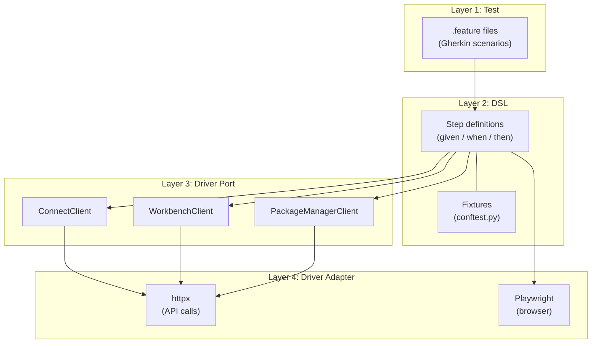

# Four-Layer Test Architecture for VIP

This document describes VIP's four-layer testing architecture. Each layer has one job and only talks to the layer directly below it.

## The Four Layers

```
Layer 1: Test           →  what we're testing (the Gherkin scenario)
Layer 2: DSL            →  how we express it (step definitions + fixtures)
Layer 3: Driver Port    →  what we need from the system (protocols/interfaces)
Layer 4: Driver Adapter →  how we interact with the system (API calls, browser clicks)
```



This separation is what makes acceptance tests maintainable. Remove any layer and the whole thing falls apart.

## Layer 1: The Test (`.feature` files)

Feature files are pure business scenarios. They contain no implementation details -- no URLs, no HTTP calls, no CSS selectors.

```gherkin
@connect
Feature: Connect authentication
  Scenario: User can log in via the web UI
    Given Connect is accessible at the configured URL
    When a user navigates to the Connect login page
    And enters valid credentials
    Then the user is successfully authenticated
    And the Connect dashboard is displayed
```

What's **not** here:
- No URLs or endpoints
- No HTTP status codes
- No CSS selectors or page structure
- No database queries
- No setup or teardown logic

The test only knows **what** it's testing. It has no idea **how** the system works. That's the point.

### Channel annotations

VIP supports running the same scenario through different channels using product marker tags (`@connect`, `@workbench`, `@package_manager`). The same business scenario can be verified through both the API and the UI when step definitions support both paths.

## Layer 2: The DSL (step definitions + fixtures)

Step definitions are where the fluent API lives. They translate Gherkin steps into actions using fixtures and driver ports.

### Given -- setting up the world

```python
@given("Connect is accessible at the configured URL")
def connect_accessible(connect_client):
    """Guard step -- ensures the product is available."""
    if connect_client is None:
        pytest.skip("Connect is not configured")
```

Given steps collect preconditions. They use **fixtures** (like `connect_client`, `vip_config`) to access configuration and verify the world is ready. When a precondition isn't met, they call `pytest.skip()` rather than fail -- this marks the test as skipped with a clear reason instead of producing a confusing assertion error.

### When -- performing the action

```python
@when("a user navigates to the Connect login page")
def navigate_to_login(page, connect_url):
    page.goto(f"{connect_url}/__login__")
```

When steps perform the action under test. They call the system through driver ports (API clients or Playwright pages). The `target_fixture` parameter passes results to subsequent steps.

### Then -- verifying the outcome

```python
@then("the user is successfully authenticated")
def user_authenticated(page, connect_url):
    assert "/__login__" not in page.url
```

Then steps verify the outcome. Importantly, they should verify **actual system state**, not just the action's return value. Make a separate call to fetch current state when possible.

### Fixtures as glue

Pytest fixtures (`conftest.py`) are the glue between layers. They provide:
- **Configuration**: `vip_config`, `connect_url`, `test_username`
- **Clients**: `connect_client`, `workbench_client`, `pm_client`
- **Browser state**: `page`, `browser_context_args`
- **Feature flags**: `email_enabled`, `monitoring_enabled`

## Layer 3: The Driver Port (protocols/interfaces)

Driver ports define **what** the DSL needs from the system without saying **how**. In VIP, these are the client interfaces in `src/vip/clients/`.

```python
# src/vip/clients/connect.py -- the port (interface)
class ConnectClient:
    """Client interface for interacting with the Connect API in tests."""

    def current_user(self) -> dict: ...
    def list_content(self) -> list[dict]: ...
    def deploy_content(self, bundle: bytes, name: str) -> dict: ...
```

Key rules for driver ports:
- **String identifiers and parameters** for maximum flexibility (allows invalid values in negative tests); non-string payloads like binary bundles are fine
- **Return dicts**, not custom model objects
- **No product SDK dependencies** -- use raw HTTP
- **Minimal surface** -- add methods only when tests need them

The port is the contract between the DSL and the system. It never changes when you switch between API and UI testing.

## Layer 4: The Driver Adapter (implementations)

This is where the same interface gets different implementations.

### API adapter (httpx)

```python
class ConnectClient:
    def __init__(self, base_url: str, *, api_key: str | None = None):
        headers = {"Authorization": f"Key {api_key}"} if api_key else {}
        self._client = httpx.Client(base_url=base_url, headers=headers)

    def current_user(self) -> dict:
        resp = self._client.get("/v1/user")
        resp.raise_for_status()
        return resp.json()
```

Straightforward HTTP calls that map requests and responses.

### UI adapter (Playwright)

```python
@when("a user navigates to the Connect login page")
def navigate_to_login(page, connect_url):
    page.goto(f"{connect_url}/__login__")

@when("enters valid credentials")
def enter_credentials(page, test_username, test_password):
    page.fill("[name='username']", test_username)
    page.fill("[name='password']", test_password)
    page.click("[data-automation='login-panel-submit']")
```

Same business action, completely different implementation. The UI adapter uses Playwright to open a browser, navigate pages, fill forms, and click buttons.

## VIP's Layer Mapping

| Layer | 4-Layer Concept | VIP Implementation |
|-------|----------------|-------------------|
| 1. Test | Scenario / specification | `.feature` files with `@product` tags |
| 2. DSL | Fluent API / step builders | `pytest_bdd` step definitions in `.py` files |
| 3. Driver Port | Interface / protocol | Client classes in `src/vip/clients/` |
| 4. Driver Adapter | API / UI implementation | httpx clients + Playwright page interactions |

## Why This Architecture Matters

Each layer protects you from a different kind of change:

- **Business rules change?** Update the `.feature` files. Step definitions and clients stay the same.
- **API endpoint changes?** Update the API client. Features, steps, and UI tests don't move.
- **UI redesign?** Update the Playwright steps. Features, API steps, and clients don't move.
- **New feature?** Add new `.feature` + `.py` pairs and extend clients. Everything existing stays untouched.

Your tests -- the things that express what the system should do -- never change unless the requirements change.

## Adding a New Test: Layer-by-Layer Checklist

1. **Layer 1 -- Feature file**: Write the Gherkin scenario with a `@product` tag. Focus on business intent, not implementation.

2. **Layer 2 -- Step definitions**: Implement `given`/`when`/`then` functions. Reuse existing steps where possible. Use `target_fixture` to pass state between steps.

3. **Layer 3 -- Driver port**: Check if the client already has the method you need. If not, add a method to the appropriate client in `src/vip/clients/`.

4. **Layer 4 -- Driver adapter**: Implement the client method using httpx (API) or add Playwright steps (UI). Keep each adapter focused on one way of talking to the system.

## Anti-Patterns to Avoid

- **Leaking implementation into features**: Don't put URLs, status codes, or selectors in `.feature` files.
- **Skipping the port layer**: Don't make HTTP calls directly in step definitions. Go through a client.
- **Fat step definitions**: If a step definition is more than ~10 lines, it's doing too much. Push logic down to the client layer.
- **Shared mutable state**: Use `target_fixture` to pass state between steps, not module-level globals.
- **Testing implementation, not behavior**: Scenarios should describe what the user experiences, not how the system works internally.
