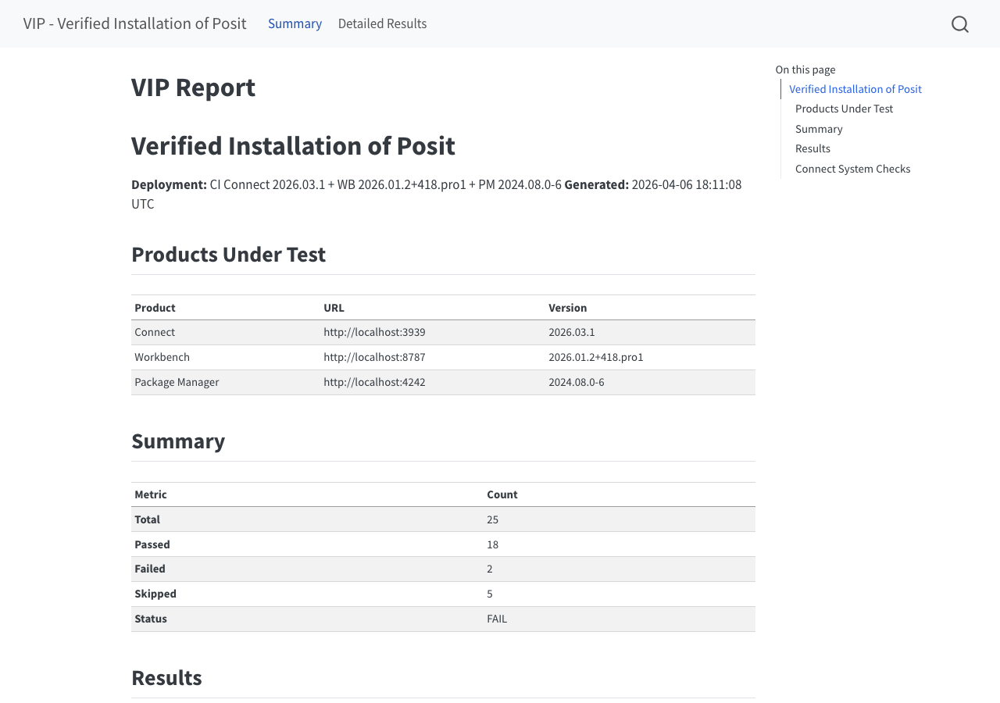

## The Problem

A customer finishes deploying Posit Team and asks:

> Is it actually working?

::: {.incremental}
- No structured way to validate a deployment end-to-end
- Manual spot-checks are slow, inconsistent, miss things
- Upgrades and config changes break things silently
:::

## What is VIP?

A test suite that runs against live Posit Team deployments.

::: {.incremental}
- Hits real APIs and real UIs, not mocks
- Tests are plain-English Gherkin files anyone can read
- Failures come with troubleshooting hints
- Cleans up after itself with `vip cleanup`
:::

## How to Run It

**Install and run:**

```bash
pip install posit-vip
vip verify --connect-url https://connect.example.com --interactive-auth
```

**Scope to the checks you care about:**

```bash
vip verify --config vip.toml --categories package-manager
```

## Your Sign-Off Document

*Example of a generated validation report*

{fig-align="center" width="85%"}

## What's Inside

<div style="display:grid; grid-template-columns:repeat(3,1fr); gap:16px; margin-top:1rem;">
<div style="background:#447099; color:white; border-radius:10px; padding:20px 16px; text-align:center;">
  
  <div style="font-size:0.65em; line-height:1.6; opacity:0.9; margin-top:6px;">Auth & Users<br>Content Deploy<br>Runtime Versions<br>System Diagnostics</div>
</div>
<div style="background:#72994E; color:white; border-radius:10px; padding:20px 16px; text-align:center;">
  
  <div style="font-size:0.65em; line-height:1.6; opacity:0.9; margin-top:6px;">Auth & Login<br>IDE Launch<br>Session Lifecycle</div>
</div>
<div style="background:#9A4665; color:white; border-radius:10px; padding:20px 16px; text-align:center;">
  
  <div style="font-size:0.65em; line-height:1.6; opacity:0.9; margin-top:6px;">CRAN Repos<br>PyPI Repos</div>
</div>
</div>
<div style="background:#4A5568; color:white; border-radius:10px; padding:14px 20px; text-align:center; margin-top:16px;">
  <span style="font-size:0.75em; font-weight:700;">Cross-Cutting</span>
  <span style="font-size:0.65em; opacity:0.9; margin-left:1.5em;">Security · Prerequisites · Performance</span>
</div>

## The Test Reads Like English

VIP is built on **BDD**, behavior-driven development. You write what the system
should do in plain language, then bind each line to code that checks it.

That plain language is called **Gherkin**. Every scenario is Given / When / Then:

```gherkin
Given  a starting condition
When   an action happens
Then   the expected result is true
```

## A Real Feature File

VIP's actual check that Connect's embedded Chronicle collector is running:

```gherkin
@connect @if_applicable @api_auth
Feature: Connect embedded Chronicle
  As a Posit Team administrator
  I want to verify Connect's embedded Chronicle subprocess is running
  So that I know usage data collection came up after enabling it

  Scenario: Chronicle reports enabled and ready
    Given Connect is accessible at the configured URL
    And Chronicle usage data collection is enabled
    When I query the Chronicle status endpoint
    Then Chronicle reports it is enabled
    And Chronicle reports it is ready
```

## What Runs It

<div style="display:grid; grid-template-columns:auto 1fr; gap:10px 18px; margin-top:1rem; font-size:0.76em; align-items:baseline;">
<code style="color:#213d4f; font-weight:700;">pytest</code><div>Python's standard test runner. Finds tests, runs them, tallies pass and fail.</div>
<code style="color:#213d4f; font-weight:700;">pytest-bdd</code><div>Binds each Gherkin line (Given / When / Then) to a Python function.</div>
<code style="color:#213d4f; font-weight:700;">httpx</code><div>Makes the API calls. Plain HTTP, no product SDK.</div>
<code style="color:#213d4f; font-weight:700;">Playwright</code><div>Drives a real Chromium browser for the UI checks.</div>
</div>

## The Testing Philosophy

Three rules constrain every test in the suite.

::: {.incremental}
- **Non-destructive.** The tests tag their created content with `_vip_test`.
- **Not mocked.** Actual HTTP validations against live services.
- **Readable without Python.** The `.feature` file is the spec.
:::

## Four-Layer Architecture

Each layer talks only to the one directly below it.

<div style="display:grid; grid-template-columns:auto 1fr; gap:12px 20px; margin-top:1rem; align-items:center;">
<div style="background:#213d4f; color:white; border-radius:8px; padding:10px 16px; text-align:center; font-weight:700;">1 · Test</div>
<div style="font-size:0.7em;">What to check, in plain Gherkin. <code>test_chronicle.feature</code></div>
<div style="background:#447099; color:white; border-radius:8px; padding:10px 16px; text-align:center; font-weight:700;">2 · DSL</div>
<div style="font-size:0.7em;">Binds each Gherkin line to a Python function. <code>test_chronicle.py</code></div>
<div style="background:#72994E; color:white; border-radius:8px; padding:10px 16px; text-align:center; font-weight:700;">3 · Driver Port</div>
<div style="font-size:0.7em;">How to ask the product. Client methods that return dicts. <code>connect.py</code></div>
<div style="background:#9A4665; color:white; border-radius:8px; padding:10px 16px; text-align:center; font-weight:700;">4 · Adapter</div>
<div style="font-size:0.7em;">The actual call: <code>httpx</code> for APIs, Playwright for UIs.</div>
</div>

## Layer 1 — The Test

The Chronicle scenario, exactly as the `.feature` file states it:

```gherkin
# test_chronicle.feature
@connect
Scenario: Chronicle reports enabled and ready
  Given Connect is accessible at the configured URL
  And Chronicle usage data collection is enabled
  When I query the Chronicle status endpoint
  Then Chronicle reports it is enabled
  And Chronicle reports it is ready
```

## Layer 2 — The Step

```python
# test_chronicle.py  — a thin step that delegates downward
@when("I query the Chronicle status endpoint", target_fixture="chronicle_status")
def query_chronicle_status(connect_client):
    return connect_client.chronicle_status()
```

This step holds no logic of its own. It calls the client method, and
`target_fixture` hands the result to the `Then` steps that check it.

## Layer 3 — The Driver Port

The client method is the contract: ask a question, get a dict back.

```python
# src/vip/clients/connect.py
def chronicle_status(self) -> dict[str, Any]:
    """Embedded Chronicle subprocess status (enabled + ready).
    Requires an admin API key."""
    ...
```

- Owns the one fact the step refused to know: the endpoint.
- Returns a plain dict, not a model object. The JSON response *is* the contract; a wrapper class would just be more code to update whenever the API adds a field.

## Layer 4 — The Adapter

Inside that method, raw `httpx` touches the wire:

```python
    resp = self._client.get("/v1/system/chronicle")   # raw httpx
    resp.raise_for_status()
    return resp.json()
```

- `raise_for_status()` turns any HTTP error into a failed test. Nothing passes on a bad response.
- The only layer that knows about transport. A UI check swaps `httpx` for Playwright, and Layers 1–3 don't change.

## Version Gating — The Marker

The Chronicle endpoint only exists in Connect **2026.06.0** and later. So:

```python
@pytest.mark.min_version(product="connect", version="2026.06.0")
@scenario("test_chronicle.feature", "Chronicle reports enabled and ready")
def test_chronicle_status():
    pass
```

The plugin reads the live product version at collection time and decides whether
the test applies.

## How VIP Tests Itself — Two Suites

<div style="display:grid; grid-template-columns:1fr 1fr; gap:16px;">
<div style="background:#447099; color:white; border-radius:10px; padding:18px;">
<b>selftests/</b>
<span style="font-size:0.8em; opacity:0.9; display:block; margin-top:4px;">Does VIP itself work?</span>
<span style="font-size:0.68em; opacity:0.92; display:block; margin-top:8px;">Tests VIP's own machinery: config parsing, the auto-skip logic, report output. No Posit products needed, so CI runs them on every push.</span>
</div>
<div style="background:#72994E; color:white; border-radius:10px; padding:18px;">
<b>src/vip_tests/</b>
<span style="font-size:0.8em; opacity:0.9; display:block; margin-top:4px;">Does the deployment work?</span>
<span style="font-size:0.68em; opacity:0.92; display:block; margin-top:8px;">The BDD checks against a real Connect, Workbench, or PM. Per-product smoke workflows stand those up as containers in CI and run the checks.</span>
</div>
</div>

## The Mock-IdP E2E Harness

`compose.mock-idp.yml` stands up a real stack behind TLS under `*.vip.test`:

<div style="display:flex; gap:10px; justify-content:center; margin:1rem 0; font-size:0.62em;">
<div style="background:#213d4f; color:white; border-radius:8px; padding:12px 14px; text-align:center;">🔑 <b>Keycloak 26.5</b><br>seeded OIDC realm<br>+ TOTP/MFA</div>
<div style="align-self:center; font-size:1.4em; color:#ee6331;">→</div>
<div style="background:#447099; color:white; border-radius:8px; padding:12px 14px; text-align:center;"><b>Connect</b><br>OIDC issuer</div>
<div style="background:#72994E; color:white; border-radius:8px; padding:12px 14px; text-align:center;"><b>Workbench</b><br>OIDC issuer</div>
</div>

This is the only workflow that drives VIP's OIDC auth (`auth.py`, `idp.py`)
end-to-end against a real identity provider. No customer IdP required.

## Mock-IdP E2E — How It Runs

```yaml
- run: docker compose -f compose.mock-idp.yml up -d --build --wait
# ... then, inside a containerized VIP runner:
- run: vip verify --headless-auth
```

::: {.incremental}
- The runner drives `vip verify`, not pytest. It tests the front door.
- `--headless-auth` reads a seeded TOTP secret and clears Keycloak's MFA on its own.
- Runs on every change to an auth-path file, and again each night at 5:30 UTC.
:::

## Writing a New Test

Generate a working example with `vip scaffold`, then edit the pair. The
`.feature` says *what* to check; the `.py` binds each line to code:

```gherkin
Scenario: Example custom health check
  When I request the custom endpoint
  Then it responds successfully
```

```python
@when("I request the custom endpoint", target_fixture="response")
def request_endpoint(my_client):
    return my_client.get("/health")
```

Point VIP at your own directory. No fork, no PR:

```toml
[general]
extension_dirs = ["/path/to/this/directory"]   # or: --vip-extensions=DIR
```

## What I'm Asking of QA / SDETs

::: {.incremental}
- **Critique.** Do we need more infrastructure like the mock-IdP stack to validate our changes? What customer-facing areas of the products would benefit from being verified by VIP?
- **Contribute.** Take one check you run by hand every release and make it a VIP test, or an `extension_dirs` check in your own repo.
- **File it.** Gaps, confusing reports, flaky checks all go to [github.com/posit-dev/vip/issues](https://github.com/posit-dev/vip/issues).
:::

## {background-color="#213d4f"}

<div style="text-align:center; color:white; margin-top:4rem;">
<div style="font-size:1.8em; font-weight:700; margin-bottom:2rem;">Thank you.</div>
<div style="font-size:0.7em; opacity:0.6; line-height:2;">
<a href="https://github.com/posit-dev/vip" style="color:rgba(255,255,255,0.6);">github.com/posit-dev/vip</a><br>
<a href="https://posit-dev.github.io/vip/example-report/" style="color:rgba(255,255,255,0.6);">posit-dev.github.io/vip/example-report</a><br>
<a href="https://ghcr.io/posit-dev/vip" style="color:rgba(255,255,255,0.6);">ghcr.io/posit-dev/vip</a>
</div>
</div>
